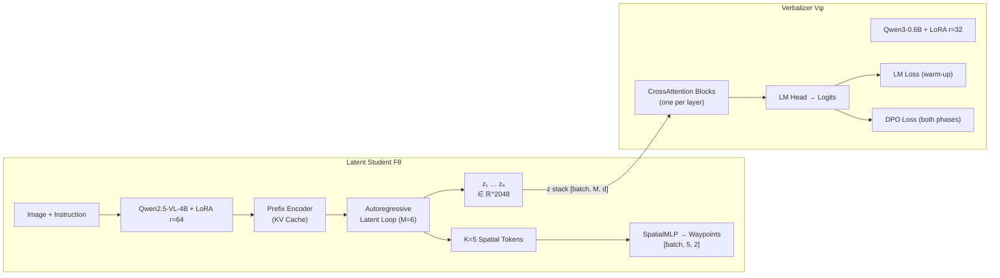
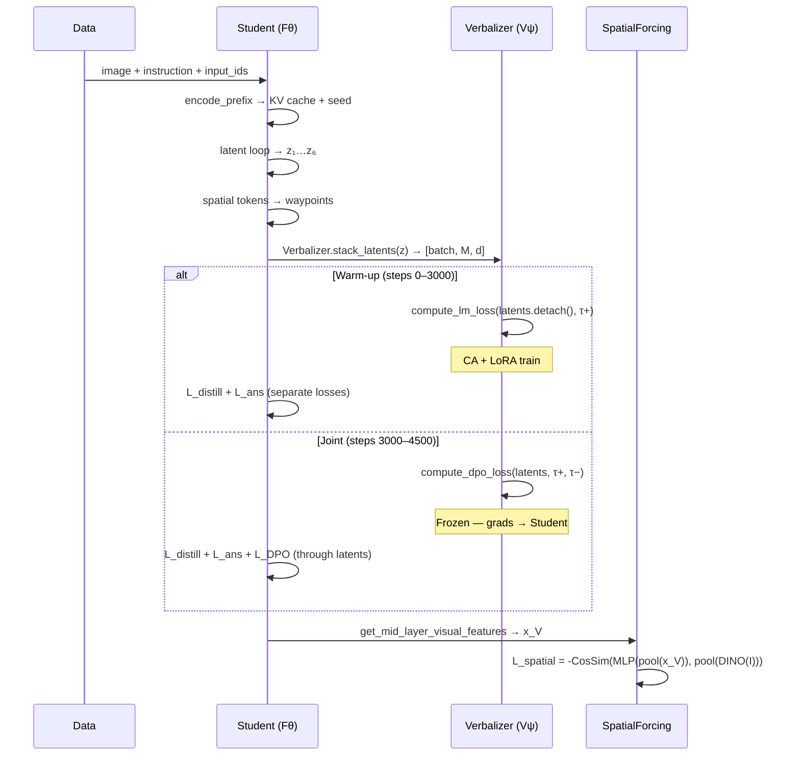

# Analysis: `latent_student.py` & `verbalizer.py`

## High-Level Architecture



---

## 1. `LatentStudent` — Fθ ([latent_student.py](file:///home/ubuntu/Shree_FYP/train/stage2/models/latent_student.py))

### 1.1 Construction

| Component | Detail |
|---|---|
| Base VLM | `Qwen2.5-VL-4B-Instruct`, loaded in **bf16** with **Flash Attention 2** |
| LoRA | rank=64, α=128, dropout=0.05, on all projection layers (`q/k/v/o/gate/up/down_proj`) |
| Spatial tokens | `nn.Parameter` shape `[K=5, d=2048]`, init with `std=0.02` |
| SpatialMLP | 3-layer `Linear→GELU→Linear→GELU→Linear→Sigmoid`, `d→d/2→d/4→2` |
| Hidden dim | 2048 (from `config.hidden_size`) |
| Layers | 28 (from `config.num_hidden_layers`), mid-layer index = 14 |

### 1.2 Key Methods

#### [`_build_input_embeds`](file:///home/ubuntu/Shree_FYP/train/stage2/models/latent_student.py#L145-L170) — Visual Token Injection

Replaces `<image_pad>` token positions with visual encoder outputs. The visual encoder runs under `torch.no_grad()` (frozen). This is the standard Qwen2.5-VL pattern for multimodal input construction.

#### [`encode_prefix`](file:///home/ubuntu/Shree_FYP/train/stage2/models/latent_student.py#L176-L211) — KV Cache Seeding

Full forward pass over `[image + instruction]`. Returns:
- `prefix_last_hidden` `[batch, d]` — seed embedding for the latent loop
- `past_key_values` — KV cache for efficient single-step continuations

#### [`generate_latents`](file:///home/ubuntu/Shree_FYP/train/stage2/models/latent_student.py#L217-L317) — Core Latent Generation

This is the heart of the model. The pipeline is:

```
Prefix → KV Cache + seed h₀
    └→ For m = 1..M:
         feed h_{m-1} as input_embed (1 token)
         → transformer step → z_m = last_hidden_state
         → z_m becomes h_m for next step
    └→ K=5 spatial tokens fed in parallel
         → SpatialMLP → waypoints ∈ [0,1]²
```

> [!IMPORTANT]
> **No vocab lookup between latent steps.** The raw hidden state `z_m` is fed directly as the next input embedding, creating a continuous "thinking" loop in embedding space. This is the core ThinkFlow innovation — reasoning happens in latent space rather than token space.

**Returns:** `(latents: List[Tensor[batch, d]], spatial_hidden: [batch, K, d], waypoints: [batch, K, 2])`

#### [`get_answer_hidden_state`](file:///home/ubuntu/Shree_FYP/train/stage2/models/latent_student.py#L323-L360) — For L_distill

Standard full-sequence forward → extracts hidden state at the `<answer>` token position. Used to compute cosine distillation loss against the Teacher's cached hidden state.

#### [`get_mid_layer_visual_features`](file:///home/ubuntu/Shree_FYP/train/stage2/models/latent_student.py#L366-L413) — For L_spatial

Forward with `output_hidden_states=True` → extracts layer 14 (L/2) hidden states at visual token positions only. This is the `x_V` input to the Spatial Forcing loss.

> [!NOTE]
> This method assumes **equal number of visual tokens per sample** in the batch (line 407: `num_visual = image_mask[0].sum().item()`). This is valid when all samples share the same image resolution/grid, but would break with variable-resolution batches.

### 1.3 Gradient Flow

| Parameter Group | Trainable? |
|---|---|
| LoRA weights (`lora_A`, `lora_B` on all 7 target modules) | ✅ Always |
| Spatial tokens (`nn.Parameter`) | ✅ Always |
| SpatialMLP parameters | ✅ Always |
| Base VLM weights | ❌ Frozen by LoRA |
| Visual encoder | ❌ Frozen explicitly (`no_grad`) |

---

## 2. `Verbalizer` — Vψ ([verbalizer.py](file:///home/ubuntu/Shree_FYP/train/stage2/models/verbalizer.py))

### 2.1 Construction

| Component | Detail |
|---|---|
| Base LM | `Qwen3-0.6B`, loaded in **bf16** with **Flash Attention 2** |
| LoRA | rank=32, α=64, dropout=0.05, on attention layers only (`q/k/v/o_proj`) |
| Cross-Attention | One `CrossAttentionBlock` per transformer layer (inserted **after** each SA+FFN) |
| DPO β | 0.1 (default) |

### 2.2 `CrossAttentionBlock` Architecture

```
Q = LayerNorm(h_l)                    ← Verbalizer hidden states [batch, seq, d_verb]
K = Linear(z, d_verb)                  ← Student latents projected [batch, M, d_verb]
V = Linear(z, d_verb)                  ← Student latents projected [batch, M, d_verb]

h_l' = LayerNorm(h_l + MHA(Q, K, V))  ← Residual + post-norm
```

Each block has its own `k_proj` and `v_proj` to bridge `d_student=2048 → d_verb` (the 0.6B model's hidden size). The attention mechanism uses `nn.MultiheadAttention` with `batch_first=True`.

> [!TIP]
> The **pre-norm on Q + post-norm on residual** pattern is a strong stabilization choice. This prevents the cross-attention output from dominating early in training when the CA weights are random.

### 2.3 `_forward_with_latents` — Manual Layer-by-Layer Forward

This is the critical method. Instead of calling `self.lm()` directly, it manually iterates through the transformer layers to inject cross-attention:

```python
for layer_idx, layer in enumerate(transformer.layers):
    hidden = layer(hidden, ...)           # Standard SA + FFN
    hidden = self.ca_blocks[layer_idx](hidden, latents)  # CA injection
hidden = transformer.norm(hidden)         # Final norm
logits = self.lm.lm_head(hidden)          # LM head
```

> [!WARNING]
> **The `transformer` reference on line 196 (`self.lm.model`) needs careful validation.** With PEFT wrapping, the model hierarchy becomes `self.lm` (PeftModel) → `.model` (base model) → `.model` (the actual transformer stack) → `.embed_tokens`, `.layers`, `.norm`. The current code accesses `self.lm.model` which may point to the PEFT-wrapped base model rather than the inner transformer. This depends on the exact PEFT version and wrapping. If `transformer.embed_tokens` works, it's correct; if not, it may need `self.lm.model.model`.

### 2.4 Loss Functions

#### [`compute_lm_loss`](file:///home/ubuntu/Shree_FYP/train/stage2/models/verbalizer.py#L304-L326) — Warm-up Phase

Standard cross-entropy on τ+ tokens. During warm-up, the caller is expected to pass `latents.detach()` to prevent gradients flowing back into the Student.

#### [`compute_dpo_loss`](file:///home/ubuntu/Shree_FYP/train/stage2/models/verbalizer.py#L328-L399) — Both Phases

DPO preference optimization with two modes:
- **With reference model**: `L = -log σ( β × [(log π(τ+) - log π_ref(τ+)) - (log π(τ-) - log π_ref(τ-))] )`
- **Without reference** (simplified): `L = -log σ( β × [log π(τ+) - log π(τ-)] )`

The method returns both the loss and a metrics dict with reward margin, accuracy, and per-policy log-probs.

### 2.5 Phase-Aware Freeze/Unfreeze

| Method | When Called | Effect |
|---|---|---|
| [`freeze_for_student_training`](file:///home/ubuntu/Shree_FYP/train/stage2/models/verbalizer.py#L405-L421) | Step 3000 | Sets `requires_grad=False` on **all** Verbalizer params |
| [`unfreeze_ca_and_lora`](file:///home/ubuntu/Shree_FYP/train/stage2/models/verbalizer.py#L423-L437) | Checkpoint resume | Re-enables CA blocks + LoRA layers |

After freezing, DPO gradients flow exclusively through the `latents` tensor back into the Student. The Verbalizer acts as a frozen "critic" — its architecture shapes the gradient signal but its weights don't update.

### 2.6 Gradient Flow by Phase

| Phase | Verbalizer Params | Student Params (via latents) |
|---|---|---|
| **Warm-up** (0–3000) | ✅ CA blocks + LoRA train | ❌ latents.detach() blocks flow |
| **Joint** (3000–4500) | ❌ All frozen | ✅ DPO gradients flow through latents |

---

## 3. Data Flow: End-to-End



---

## 4. Issues & Observations

### 🔴 Potential Issues

1. **PEFT Model Hierarchy** (verbalizer.py L196)
   The line `transformer = self.lm.model` may resolve incorrectly depending on PEFT version. With `get_peft_model()`, the hierarchy is typically `PeftModelForCausalLM.model → PreTrainedModel`. Accessing `.embed_tokens` and `.layers` requires reaching the inner transformer, which is usually at `.model.model` for Qwen3 (i.e., `self.lm.model.model`). **This should be validated at runtime.**

2. **Variable Visual Token Count** (latent_student.py L407)
   `num_visual = image_mask[0].sum().item()` — uses only the first sample's count. Will raise a reshape error if samples have different numbers of visual tokens.

3. **Missing `lm_head` Access Path** (verbalizer.py L246)
   After PEFT wrapping, `self.lm.lm_head` may not be directly accessible. It's typically at `self.lm.model.lm_head` or `self.lm.get_base_model().lm_head`. This depends on the PEFT version.

### 🟡 Design Observations

4. **No Gradient Checkpointing** — Both models run full forward passes. For the Student's 28-layer 4B model with M=6 sequential steps, this means ~7 full forward passes worth of activations in memory. Consider enabling `gradient_checkpointing_enable()`.

5. **Sequential Latent Steps** — The M=6 latent steps are inherently sequential (each depends on the previous). This is a training throughput bottleneck but is architecturally necessary.

6. **Flash Attention in CA Blocks** — The `CrossAttentionBlock` uses `nn.MultiheadAttention`, which does **not** use Flash Attention. Since the KV length is only M=6, this is negligible, but worth noting for consistency.

7. **Spatial Token Parallelism** — Good design: all K=5 spatial tokens are processed in a single parallel forward pass rather than K sequential steps.

8. **DPO β=0.1** — Relatively conservative. The simplified reference-free DPO variant is the default path, which is fine for distillation where the reference policy is less critical.

### 🟢 Strengths

9. **Clean Separation** — The Student produces latents; the Verbalizer consumes them. No circular dependencies. The `stack_latents()` static method is a clean interface contract.

10. **Phase-Aware Gradient Routing** — The freeze/unfreeze mechanism is simple and correct. The critical insight that `latents.detach()` vs not controls Student gradient flow is well-documented in the docstrings.

11. **Comprehensive Docstrings** — Both files have excellent inline documentation explaining the "why" behind architectural choices.

12. **Pre-norm + Post-norm in CA** — This dual normalization pattern in the cross-attention blocks is a strong stabilization choice for training new attention modules on top of a pretrained backbone.
